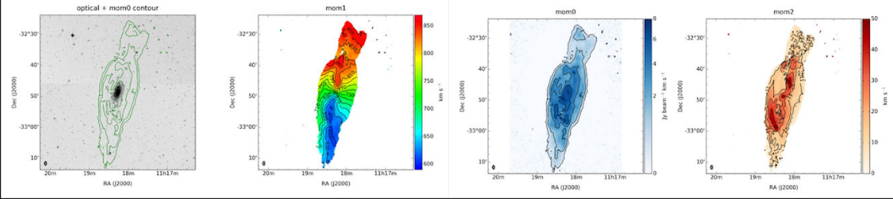
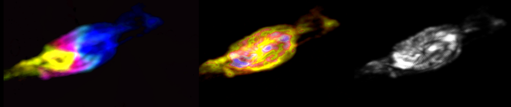

# Radio-Vulkan

## Introduction
This project is curently a work in progress. The core idea is to provide a Vulkan-based HPG framework for DataCubes visualisation and explore the following advantages for HPC astrophysics data visualisation:

- Cross-platform / performance portability
- Flexibility for programming our tasks. Natively supports rasterization and ray-tracing rendering approaches

The approach to volume particle-based rendering considers both rasterization and ray-tracing pipelines. Currently, the 4 main classes are introduced:

1.Context: Performs main configuration and creates physical and logical devices. Idea of the class in much inspired by Nvidia samples

2.RenderBase: performs rendering related procedures, handles interactive or headless rendering

3.PipelineBase: creates graphic or rasterization pipeline and sets it up

SimpCamera: an example of camera that also loads the updated transformation buffer to GPU

4.Loader: reads Fits data and loads it to GPU

## Visualisation examples

The Local Volume HI Survey (LVHIS) [Koribalski et al. 2018](http://adsabs.harvard.edu/abs/2018MNRAS.478.1611K) was used as database. See visualisation examples for NGC 3621 galaxy (Fig.1) for different TFs. Original idea from [Vohl, 2017] (https://arxiv.org/abs/1707.00442)

Figure 1. NGC 3621 data obtained from [LVHIS] (https://www.atnf.csiro.au/research/LVHIS/data/LVHIS031.info.html)

Figure 2. Experiments with Transfer Functions for particle-based volume visualisation of NGC3621 spiral galaxy

## Current notes
 
Currently only interactive version with rasterization pipeline is working. The coding would be finelised on final stage as all use cases are implemented and integrated: rasterization/ray-tracing and headless/interactive. Please, currently, leave all CMake values with default configuration.

 
Please, also note that NVIDIA nvvk:: codes are compiled but not used in this version. At some point I will probably have to rewrite/remove them although there are some interesting architectural and implementational ideas there and they are good for fast prototyping.
